# Pràctica 1: VIEWS I TEMPLATES

## Feina individual
1. Crear un projecte de DJANGO de nom TIC_BCN_inicials alumnat. 
    El nom de l’aplicació a on s’hi afegiran els templates i les views és centre.

    Es farà una aplicació per mostrar dades de l’alumnat de DAW2A i del seu professorat (dades reals).

    Dades a mostrar alumnat: nom, cognom1, cognom2, correu, curs, mòduls matriculats.
    Dades a mostrar prof.: nom, cognom1, cognom2, correu, curs, tutor(si s’escau),mòduls que imparteix.

    Path alumne: localhost:8000/centre/students
    Path professor: localhost:8000/centre/teachers

    Només la pàgina principal (del projecte) ha de renderitzar també un header. Aquest header sempre es mostrarà (independentment de si està mostrant dades de professorat o d’alumnat).

## Captures pantalla
[Video](https://drive.google.com/file/d/1jIkzvrFWLZFM-BKOpgkM8RROPbVAOziy/view?usp=drive_link)

Llistat alumnes
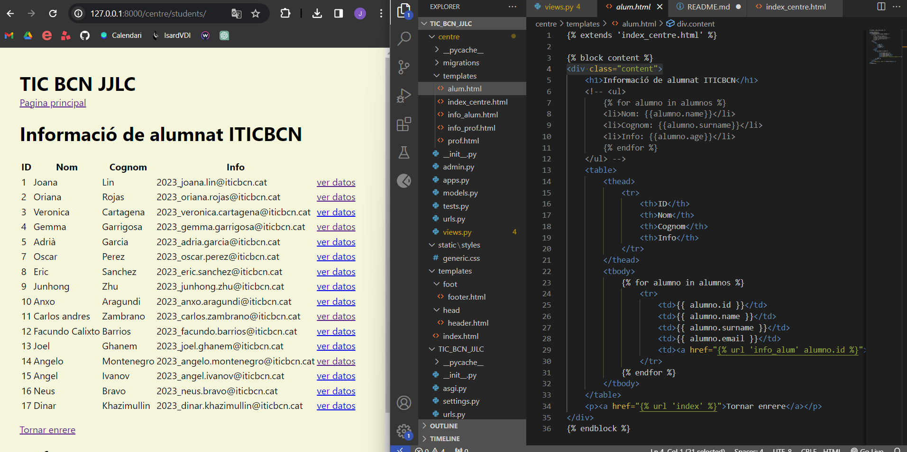
Info alumne
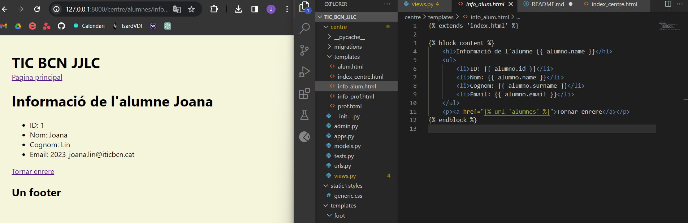
Llistat professors
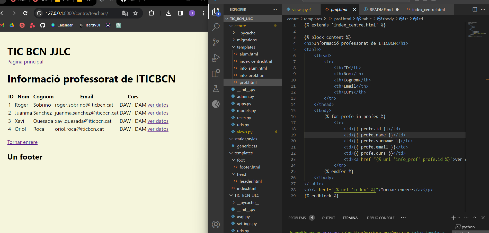
Info professor
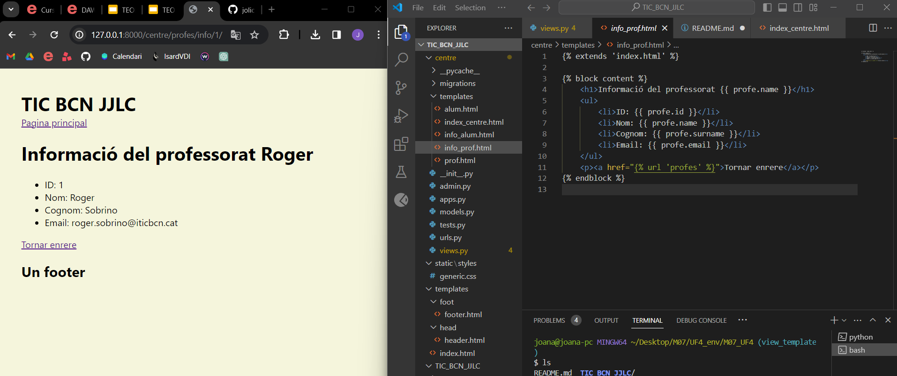

# Pràctica 2: models
Afegir la part del model a la pràctica 1 connectant amb un PostgreSQL. Es crea la BBDD desde Django, amb Models (NO a pgAdmin4).

A la base de dades ha d’haver 1 taula amb 6 (mínim id i rol) camps (sense comptar el id ja que es crea automàticament).

## Captura pantalla
[Video](https://drive.google.com/file/d/1gsQxlekg3KyRQSXjvlsIuMHRu8xVV-RX/view?usp=drive_link)

comandes: python manage.py makemgrations | python manage.py migrate

Migració
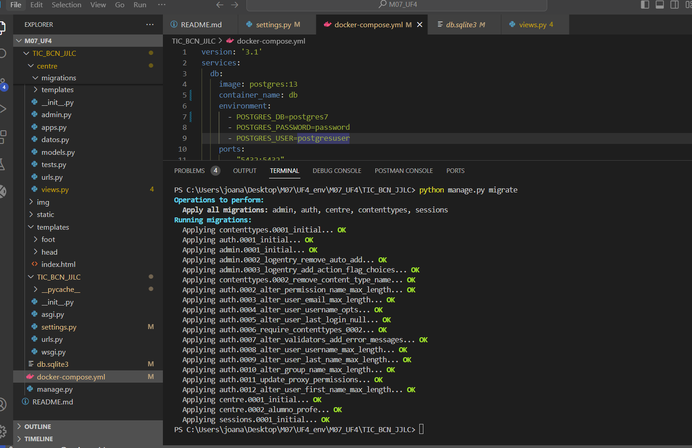
Models
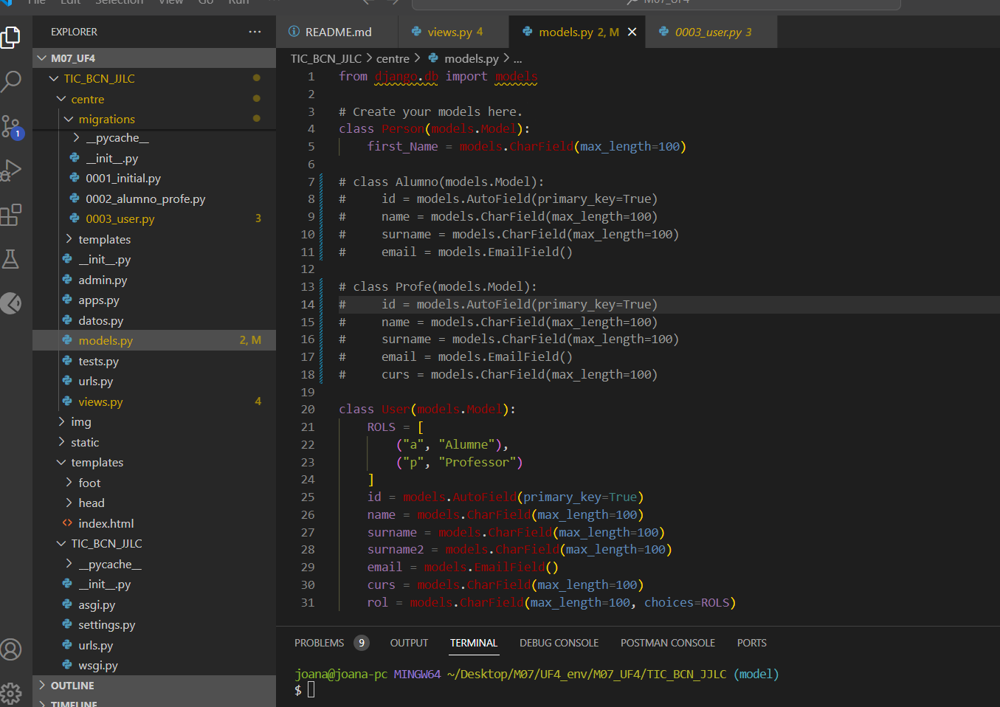
Taula
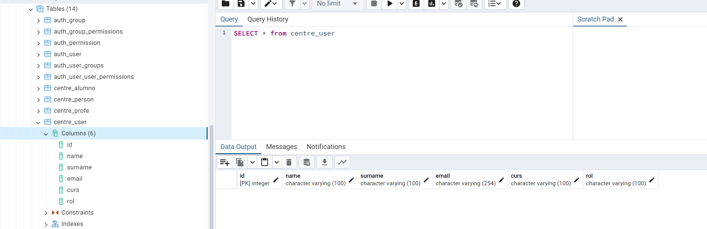

# Pràctica 3: form
Crear un formulari (sense funcionalitat) per afegir alumnat i professorat..

S’ha de tindre una BBDD amb els camps necessaris (sense comptar id)

El formulari ha de tindre tots els camps de la taula de la BBDD.
    
El template del projecte haurà de tindre 2 enllaços (alumnat i professorat) que ja s’han implementat a la pràctica 1, i se li afegirà 1 enllaç més pel formulari. Quan se li doni a l’enllaç del formulari, a sota, s’haurà de renderitzar el formulari. Es podrà utilitzar el formulari fins que se li doni a qualsevol altre enllaç.

## Captura pantalla
Amb as_p
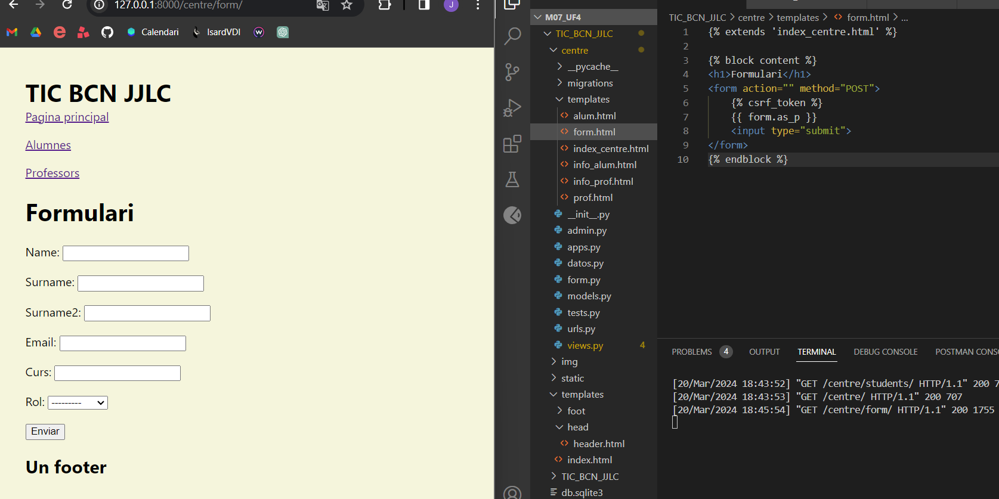
Sense as_p
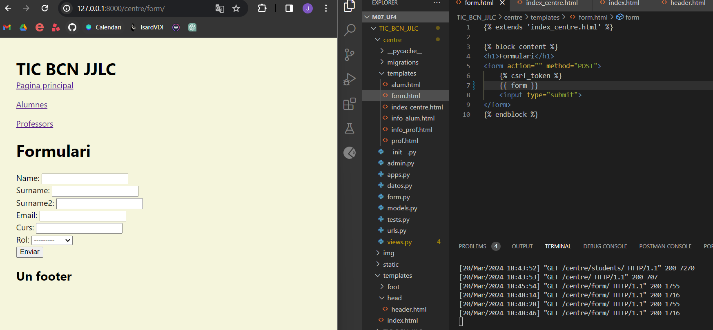

# Pràctica 4: CRUD
Crear el CRUD del vostre projecte. Penseu que el formulari (no funcional) ja el teniu creat de la pràctica anterior, només cal afegir-li la funcionalitat.

És OBLIGATORI fer un commit per a cada element del CRUD creat. És a dir, una vegada tingueu funcional el Create, fer un commit de missatge “Create acabat”. I així amb el Read, Update i Delete.

En cas d’haver de modificar algún error d’un commit anterior (per exemple del Create), posar de missatge “modificació Create”. 

## Captures pantalla

Abans de crear:
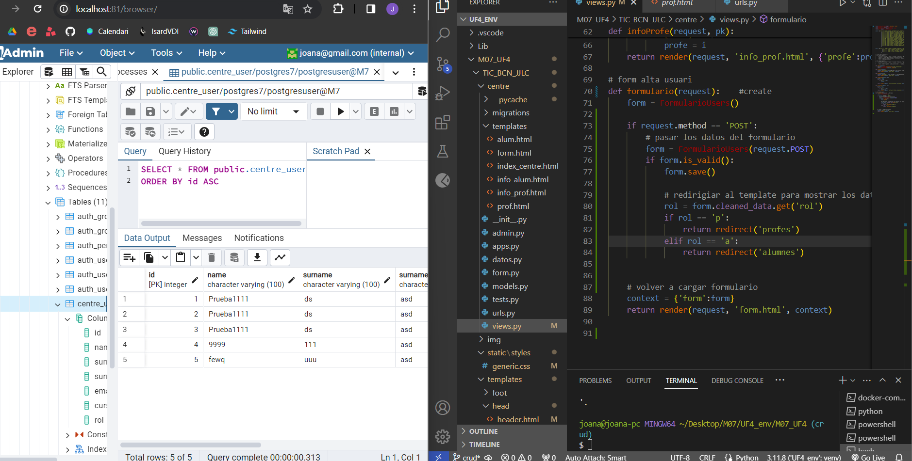
Crear:
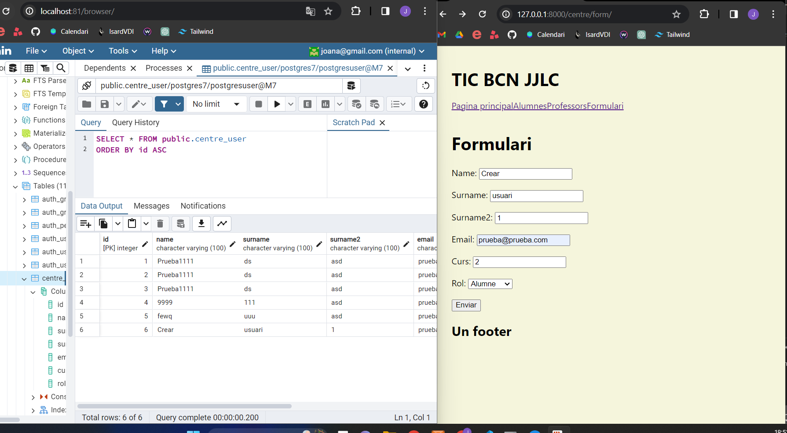